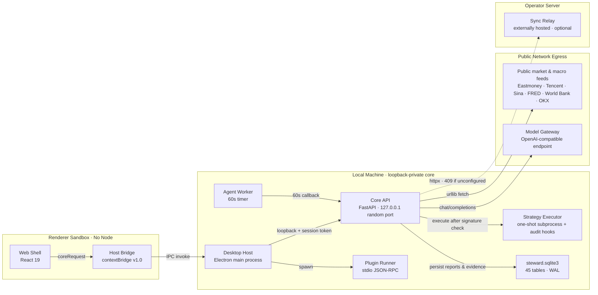

<div align="center">
  

# AI Investment Steward

**A local-first, evidence-driven investment research desktop application.**

**English** · [简体中文](README.zh-CN.md)

</div>

AI Investment Steward runs on Windows desktop first (a browser serves as the development preview) and is built for individual investors with A-share / ETF experience who want to run their investments as a disciplined system. It answers four questions:

- What happened today that genuinely affects my holdings, watchlist, or investment plan?
- Is my original investment thesis still supported by evidence?
- Should my next step be further research, continued observation, a plan review, or no action for now?
- What data does each judgment rest on, when was it generated, what evidence contradicts it, and what remains uncertain?

> **Disclaimer.** This software is a personal research and record-keeping tool. It does not provide investment advice, does not execute trades, and its outputs must not be treated as recommendations. All investment decisions remain the user's own responsibility.

## Key Features

### Investment Memory and Evidence-Based Answers

- Holdings / watchlist, investment theses (assumptions and invalidation conditions), decision logs, and versioned investment principles are all persisted in a local SQLite database;
- Research pipelines produce structured answers — evidence IDs, source timestamps, contradictory evidence, stated limitations, and one of four action modes (research further / observe / review / no action). When evidence is missing, the system says so instead of fabricating it.

### AI Research Workbench

- **Multi-model comparison** — select multiple model profiles to generate research reports on the same instrument and compare them side by side; execution may be parallel (fast) or serial (quota-friendly, avoids rate limits); a cross-report synthesis presents consensus / disagreement / items to verify (disagreements are reported honestly, never voted away);
- **Collaborative pipeline** — for a single stock, four roles run strictly in sequence: data verification → chief-analyst draft → risk review → chief-analyst revision. Each role may use a different model (falling back to the active profile when unset); revised drafts are archived automatically;
- **Directional assessment** — structured reports with required sections; collapsed rows show section name, word count, and preview; missing sections and judgments without citations are flagged explicitly rather than relying on "looks complete";
- **Evidence management** — filings, news, and financial evidence grouped and displayed by category with one-click serial fetching; content-hash normalization deduplicates entries (pre-ingestion interception plus one-click historical cleanup), so re-published filings no longer create duplicates;
- **Archived outputs** — directional assessments, single-stock reports, and collaborative reports are all persisted locally and can be filtered by type / model / time range / keyword; single and batch export to Markdown / HTML.

### Macro Radar

- World map with the four major economies as nodes, relationship arcs, and event anchors (grain / fertilizer / energy / crude oil);
- Economic data release board (CPI / non-farm payrolls / rates: prior vs. actual), gold, oil, FX, and the US Dollar Index;
- External data is fetched once and cached locally; source and observation date remain traceable.

### Quantitative Research and Strategy Sharing Pool (Professional mode, hidden by default)

- **Factor mining** — 6 built-in features plus a stacked operator set; deterministic enumeration of the formula space, ranked by validation-set IC; identical inputs always yield identical results;
- **Parameter sets** — pure-JSON formulas executed by the official kernel; deterministic replay (tanh position sizing × next-day return), Fork lineage, one-click export;
- **Strategy packages** — only packages signed with the publisher's Ed25519 key are executed; a restricted executor (one-shot subprocess + audit hooks) blocks file, network, and subprocess access, with hard timeout termination;
- **Live performance records** — a two-tier system of self-reported results and statement verification, with statement content anchored by SHA-256; used only for screening, never for ranking;
- **Linear models** — 6-feature closed-form ridge regression; weights are pure JSON executed by the kernel, and training snapshots are fully reproducible;
- The sharing pool's default ranking deliberately excludes returns — every number carries its stated methodology.

### Plugin System

- Official plugins (market data, macro radar, research library, learning coach, stock tactics radar, etc.) are Ed25519-signed, capability-granted, and disclose their data destinations; installable from the extensions page;
- The plugin runtime is a separate JSON-RPC process: `apps/plugin-runner`.

### Stock Tactics Radar (`official.stock-tactics`)

- 15 classical technical-pattern detectors (SMA / EMA / RSI / MACD / KDJ engines); coarse-filters the whole market through board rankings (turnover / gainers / turnover rate), then scans each candidate individually; results link directly into AI research reports.

### Jev Decision-Model Semantic Review (optional)

Tactics-radar rule scores, report citation support, and notification priority are all governed by deterministic rules. Jev adds a **semantic review layer** on top — presenting "the rule says it holds" alongside "the semantics hold up"; disagreement itself is a signal.

- **Six scenarios** — tactics-scan false-positive screening (JV05), per-claim citation support and fabrication risk (JV04), follow-up verification triage (JV06), action-mode routing (JV07), notification triage (JV08), tactics review judgment layer (JV03);
- **Annotation only, never overrides** — semantic conclusions are shown side by side; they never overwrite rule scores, never rewrite a model's self-reported action mode, never delete candidates, and never re-rank; when a judgment cannot be established, it is marked "not obtained" rather than silently passed;
- **Globally switchable** — with the master switch off there is zero network egress and responses are byte-identical to pre-integration behavior; when `model_access_enabled=0` (models globally disabled), the routing layer does not run either — it already runs on the local engine, so no extra call is spent;
- **Auditable and reproducible** — every call is persisted to `model_calls`, grouped by `purpose` (`jev:scan-review` / `jev:claim-support` / `jev:followup-triage` / `jev:action-routing` / `jev:notify-triage` / `jev:tactics-review`); routing and triage decisions are audited with the full question receipt; keys never enter the audit trail;
- **Thresholds calibrated on Chinese data** — after two rounds of CJK calibration the `noul` three-way thresholds remain 0.85 / 0.3 (each round showed clean separation on its own; the merged boundary differed by only 0.02, so under the "changes must show clear benefit" rule they were left unchanged); the four `confidence` floors still use the official 0.5 and are explicitly labeled uncalibrated; usage always takes the conservative direction (below threshold → no folding / no suppression / no rerouting).

### Trust Infrastructure

- Data stays on the local machine by default; rotating backups on startup; full data export (JSON, verifiable table by table; excludes keys and device state by default — see the `export_policy` of `/export/all`);
- Investment-principle changes require explicit confirmation and are written to the audit log; the kernel listens on loopback only and generates a random access token at each startup.

### Desktop Experience

- Tray-resident, single instance, `Ctrl+K` command palette, global shortcuts;
- Three themes: Dark · Ink Green (default) / Dark · Graphite / Light · Daylight, switchable instantly in settings; preferences are stored locally only;
- Under the light theme, semantic colors are deepened to WCAG AA (up/down colors and secondary text measured at 4.5:1 on white);
- Comfortable / compact density; red-up vs. green-up and mint/amber up-down semantics are switchable.

## Architecture Overview

Main path in one line: UI → versioned IPC bridge → Electron main process (injects a random session token) → FastAPI core → data fetching / model calls → local SQLite.

| View | Location |
| --- | --- |
| Interactive system architecture diagram (zoom, edge tracing, dark/light themes, PNG/SVG export) | [docs/architecture/system-architecture-2026-09-20.html](docs/architecture/system-architecture-2026-09-20.html) |
| Maintainable spec source for the same diagram (18 `file:line` citations, pinned to commit `98995fa`) | [docs/architecture/system-architecture-2026-09-20.json](docs/architecture/system-architecture-2026-09-20.json) |
| Interactive runtime architecture diagram (processes, data flow, egress) | [docs/architecture/runtime-architecture-2026-09-24.html](docs/architecture/runtime-architecture-2026-09-24.html) |
| Spec source for the runtime diagram | [docs/architecture/runtime-architecture-2026-09-24.architecture.json](docs/architecture/runtime-architecture-2026-09-24.architecture.json) |



- **Ownership** — every desktop process runs on the user's machine; only the model gateway and `apps/relay` exist outside it, and the relay is never launched by the desktop app nor shipped in installers.
- **Trust boundaries** — the renderer runs with `contextIsolation` + `sandbox`, has no Node access, and never sees the token; the bridge only allows ~110 whitelisted paths (`pnpm check:bridge` is a hard packaging gate); the core validates `X-Core-Session-Token` on 217 of 220 routes and listens on 127.0.0.1 only.
- **Restricted execution** — plugins and strategy packages must be Ed25519-signed; strategy packages run in a one-shot subprocess under PEP 578 audit hooks with file / network / subprocess access blocked and a 30 s hard kill (self-declared as not container-grade isolation).
- **Egress surface** — three categories only: public data sources, the model gateway (`STEWARD_MODEL_ACCESS=0` disables it globally), and an optional end-to-end-encrypted sync relay.

## Technology Stack

| Layer | Technology | Location |
| --- | --- | --- |
| Desktop host | Electron (tray, single instance, window management, sidecar orchestration) | `apps/desktop-host` |
| UI | React 19 + TypeScript + Vite | `apps/web-shell` |
| Core | Python 3.12 · FastAPI · Pydantic v2 · SQLite | `apps/core-api` |
| Agent worker | Separate process; schedules briefings / evidence patrols / notification persistence | `apps/agent-worker` |
| Plugin runtime | Separate-process JSON-RPC | `apps/plugin-runner` |
| Relay (multi-device sync, reserved) | Server-side relay | `apps/relay` |
| Design-preview shell | Electron loading design HTML (`STEWARD_SHOT` auto-screenshot) | `apps/desktop-preview` |
| Cross-language contracts | Pydantic as the single source; published JSON Schemas | `packages/domain-contracts` |
| Host bridge | Versioned IPC bridge (URL whitelist regex) | `packages/host-bridge` |
| UI card contracts | Card schemas | `packages/ui-card-schemas` |

## Getting Started

```bash
pnpm install
```

Local development (recommended; starts Core + Web + Agent Worker together, with the desktop shell attached directly):

```bash
powershell -ExecutionPolicy Bypass -File scripts/start-local.ps1 -Desktop
```

Without `-Desktop`, only the three services start; open `http://127.0.0.1:5173` in a browser. Script defaults: Core `18765`, Web `5173`, `--session-token manual-test-token`, data directory `.local-data`; process metadata is written to `.runtime-local/local-processes.json`.

> The desktop shell in development mode **does not** spawn the backend itself: when `STEWARD_WEB_URL` is set it connects straight to Vite, sharing the same database and views as the browser (see the `devMode` branch in `apps/desktop-host/src/main.ts`). Only the packaged build spawns the frozen `steward-backend.exe`.

Starting the core alone:

```bash
uv sync --directory apps/core-api
uv run --directory apps/core-api python -m investment_steward_core --port 8765 --session-token dev-only-token
```

For browser development against a local core: copy `apps/web-shell/.env.example` to `.env.local` and set `VITE_DEV_PROXY` / `VITE_CORE_BASE` / `VITE_CORE_TOKEN` as needed.

## Common Commands

| Command | Purpose |
| --- | --- |
| `pnpm dev:web` | Start the UI only (Vite) |
| `pnpm dev:desktop` | Start the Electron shell (without `STEWARD_WEB_URL`, it looks for the sidecar as in packaged mode) |
| `pnpm start:local` | Local development script (equivalent to the PowerShell call above; append `-Desktop` by invoking the script directly) |
| `pnpm typecheck` | Type-check the whole monorepo (`pnpm -r typecheck`) |
| `pnpm build:web` | Build the UI |
| `pnpm core:test` | Core tests (pytest) |
| `pnpm core:lint` / `core:format-check` | Core ruff lint / format check |
| `pnpm test:contracts` | Domain-contract tests |
| `pnpm check:bridge` | Host-bridge coverage check |
| `pnpm --filter @investment-steward/web-shell test` | UI unit tests (vitest) |
| `.venv/Scripts/python.exe scripts/calibrate-jev-cjk.py <build\|run\|analyze\|dry-run>` | Jev CJK threshold calibration (four phases: `build` samples the corpus → `run` makes network calls → `analyze` writes the report → `dry-run` synthetic self-check; only `run` egresses) |

Core tests require two environment variables (`apps/core-api` is a src layout, and a locally installed third-party pytest plugin crashes on autoload):

```bash
PYTEST_DISABLE_PLUGIN_AUTOLOAD=1 PYTHONPATH=src uv run --directory apps/core-api pytest
```

## Data Sources

| Data | Source |
| --- | --- |
| US macro (employment / CPI / rates / spreads), oil, USD index, FX, S&P, VIX | [FRED](https://fred.stlouisfed.org/) (free API key) |
| China / EU / Japan / India macro (annual), China PMI | [World Bank](https://www.worldbank.org/) · [Eastmoney Data Center](https://data.eastmoney.com/) |
| China aggregate financing, urban surveyed unemployment rate | **Not yet wired**: the core registers both as "pending data source" (PBOC / National Bureau of Statistics); no values are produced and the UI shows `pending` (see the 2026-09-06 probe log in `macro_feed.py`) |
| A-share K-lines, filings, news, financials | Eastmoney public APIs |
| A-share whole-market rankings (turnover / gainers / turnover-rate coarse filter) | Sina Finance public quotes API |
| Gold | OKX public quotes (XAUT) |

All external data is fetched once and written to the local cache; subsequent reads hit the cache directly. Source, observation date, and version remain traceable, and the data is used only as "the user's local evidence" — it is never re-distributed in bulk.

## Architecture Principles

- Domain contracts first (`packages/domain-contracts`): cross-language fields originate solely from Pydantic models;
- Clear process boundaries: the UI never touches the filesystem, keys, or subprocesses, and reaches the core only through the versioned bridge;
- The core listens on loopback only and generates a random access token per startup; plugins and strategy packages are signature-verified with least-privilege capability grants;
- The sharing pool displays only reproducible artifacts: the default ranking never contains returns, and live performance records use a two-tier system that does not affect ranking;
- When there is no data, say so: every "retrieved" claim must trace back to a real fetch record; failed fetches are written to `source_errors` instead of left blank.

## Building and Packaging (Windows)

The version is maintained only in the `version` field of `apps/desktop-host/package.json`.

```bash
# 1) Freeze the Python backend into a single exe (onefile; core/worker/runner modes)
#    Must use the repository .venv's PyInstaller; use a fresh workpath/distpath each time — never reuse old directories
cd apps/desktop-host/tools
../../../.venv/Scripts/python.exe -m PyInstaller --noconfirm --distpath dist --workpath buildN steward-backend.spec

# 2) Build the UI (the desktop shell reads artifacts from resources)
pnpm build:web

# 3) Package the desktop app: bridge coverage check → tsc → electron-builder --win
pnpm --filter @investment-steward/desktop-host dist:win
```

Artifacts land in `dist-desktop2/` (`build.directories.output` in `apps/desktop-host/package.json`), containing the NSIS installer and a portable exe.

Icons: `apps/desktop-host/resources/icon.ico` (nine frames, 16–256px) and `icon.png` are cropped from the master image `icon-master.png`; `pnpm build:icon` is the older procedural generator — it refuses to run when the master image is present; add `--force-v3` only to force the fallback.

## Repository Structure

```
apps/
  core-api/        Python core (FastAPI + SQLite, src layout)
  web-shell/       React UI
  desktop-host/    Electron shell + sidecar freeze config
  agent-worker/    Scheduled-task process
  plugin-runner/   Plugin runtime
  relay/           Multi-device sync relay (reserved)
  desktop-preview/ Design-preview shell
packages/
  domain-contracts/ host-bridge/ ui-card-schemas/
plugins/           Official plugin sources and signed artifacts
scripts/           Development, acceptance, and packaging helpers
docs/              Architecture showcase, site landing page, README assets (internal process docs stay local)
```

## Documentation

Internal working documents — task roadmaps, design plans, implementation records, and evidence archives — are kept locally and are intentionally not part of this public repository. The published documentation is the interactive architecture showcase linked under [Architecture Overview](#architecture-overview), together with this README (English / [简体中文](README.zh-CN.md)).

## Community

- QQ user group: scan the QR code below to join (group **984263375**) — feedback, usage discussion, and release announcements;
- Commercial licensing: see [License](#license) — contact `1634594707@qq.com`.

<div align="center">
  

*Scan with QQ to join the group*

</div>

## License

Copyright (c) 2026 aplicity. All rights reserved.

Released under the [Investment Steward License 1.0](LICENSE) — **not** an open-source license:

- **Non-commercial use is free.** Personal, educational, and research use, as well as modification and redistribution for non-commercial purposes, are permitted at no charge, provided the license and copyright notices are retained.
- **Commercial use requires a prior written license from the copyright holder.** This includes, without limitation: selling or sublicensing the software, offering its functionality as a paid or hosted service, using it in the business operations of a for-profit organization, or bundling it into a paid product or service.
- **To request a commercial license**, contact the copyright holder: **aplicity** — `1634594707@qq.com`.

THE SOFTWARE IS PROVIDED "AS IS", WITHOUT WARRANTY OF ANY KIND, EXPRESS OR IMPLIED. THIS SOFTWARE IS A RESEARCH AND RECORD-KEEPING TOOL AND DOES NOT CONSTITUTE INVESTMENT ADVICE.
