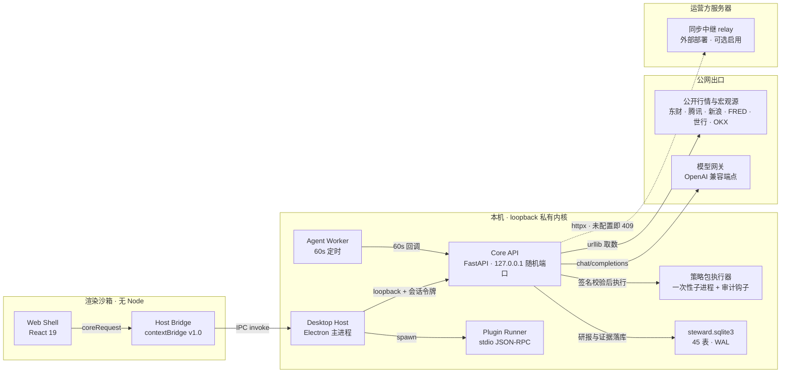

<div align="center">
  

# AI Investment Steward

**本地优先、证据驱动的智能投资研究桌面应用**

[English](README.md) · **简体中文**

</div>

AI Investment Steward 以 Windows 桌面端为主（浏览器可作开发预览），面向有 A 股 / ETF 经验、希望建立体系的个人投资者，回答四个问题：

- 今天发生了什么，真正影响了我的持仓、关注标的或投资计划？
- 我原来的投资逻辑，还有没有被证据支持？
- 下一步应该补研究、继续观察、复盘计划，还是暂时不行动？
- 这个判断依据什么数据、何时生成、哪些证据相反、还有什么不确定？

> **免责声明。** 本软件是个人研究与记录工具，不提供投资建议、不执行交易，其产出不得视为荐股依据。所有投资决策由用户自行负责。

## 核心特性

### 投资记忆与有据回答

- 持仓 / 自选、投资逻辑（假设与失效条件）、决策日志、投资原则版本，全部落本机 SQLite；
- 研究链路产出结构化回答——证据编号、来源时间、相反证据、局限与四选一行动模式（补研究 / 观察 / 复盘 / 不行动）；没有证据就明说，不编造。

### AI 研究工作台

- **多模型对比**——勾选多个模型方案对同一标的生成研报，同屏对比；执行方式可选并行（快）或串行（省额度、避开限速）；跨报告综合给出共识 / 分歧 / 待核验（分歧如实陈列，不投票）；
- **协同流水线**——单股四角色严格串行：数据核对 → 首席初稿 → 风险审查 → 首席修订；每个角色可分配不同模型（留空回落「使用中」方案），修订稿自动留档；
- **方向研判**——按必需小节产出结构化报告，折叠行给出小节名、字数与预览；小节缺失、判断无引用都会显式标出，不靠「看起来完整」；
- **证据管理**——公告 / 新闻 / 财务证据分类分组展示，一键串行拉取；内容哈希归一化查重（落库前拦截 + 历史一键去重），公告重发不再产生重复条目；
- **产出留档**——方向研判 / 个股研报 / 协同研报全部落本机库，可按类型 / 模型 / 时间范围 / 关键字筛选回看；单份与批量导出 Markdown / HTML。

### 宏观雷达

- 世界地图 + 四大经济体节点 + 关系弧线 + 事件锚点（粮食 / 化肥 / 能源 / 原油）；
- 经济数据发布看板（CPI / 非农 / 利率：前值与实际）、金价油价汇率、美元指数；
- 外部数据实拉一次即落本机缓存，来源与观测日可追溯。

### 量化研究与策略分享池（专业模式，默认隐藏）

- **因子挖掘**——内置 6 特征 + 栈式算子，确定性枚举公式空间，按验证集 IC 排序，同输入同结果；
- **参数集**——纯 JSON 公式，官方内核解释执行，确定性回放（tanh 仓位 × 次日收益）、Fork 派生谱系、一键导出；
- **策略包**——仅运行发布者 Ed25519 签名的包；受限执行器（一次性子进程 + 审计钩子）阻断文件 / 网络 / 子进程访问，超时强制终止；
- **实盘记录**——自报与对账单核验两级制，对账单内容 SHA-256 锚定；只作筛选，绝不参与排序；
- **线性模型**——6 特征闭式岭回归，权重纯 JSON 由内核解释执行，训练快照完整可复算；
- 分享池默认排序不含收益率——这是刻意的；每个数字都挂口径。

### 插件体系

- 官方插件（行情、宏观雷达、研读图书馆、学习教练、战法雷达等）Ed25519 签名、能力授予、数据去向明示，扩展页一键安装；
- 插件运行时是独立进程 JSON-RPC：`apps/plugin-runner`。

### 战法雷达（`official.stock-tactics`）

- 15 类经典技术形态检测器（SMA / EMA / RSI / MACD / KDJ 引擎），对全市场榜单（成交额 / 涨幅 / 换手）粗筛后逐票扫描，结果可一键跳转 AI 研报。

### 决策模型语义校验（Jev，可选接入）

战法雷达的规则分、研报的引用支撑、通知的优先级，本质都是「确定性规则说了算」。Jev 是在其上加的一层**语义复核**——把「规则说成立」与「语义上站得住」并列，分歧本身就是信号。

- **六个场景**——战法扫描去误报（JV05）、研报逐条引用支撑校验与编造风险（JV04）、验证点优先级分诊（JV06）、行动模式预判路由（JV07）、通知分诊（JV08）、战法复核判定层（JV03）；
- **只标注、不改判定**——语义结论一律并列展示，不覆盖规则分、不改写模型自报的行动模式、不删除候选、不重排；判定不成立时如实标注「未取得」而不是静默通过；
- **可整体关闭**——总闸关闭时**零出网**、响应与接入前逐字节一致；`model_access_enabled=0`（模型全局断网）时预判层同样不跑——本来就走本地引擎，没必要多花一次调用；
- **留痕可复算**——每次调用落 `model_calls`，按 `purpose` 分组（`jev:scan-review` / `jev:claim-support` / `jev:followup-triage` / `jev:action-routing` / `jev:notify-triage` / `jev:tactics-review`）；路由与分诊决策落审计并含完整题目回执，密钥绝不进审计；
- **阈值来自中文标定**——`noul` 三路阈值经两轮中文标定后**维持 0.85 / 0.3**（两轮各看各的都「完美分离」，合并后边界只差 0.02，故按「改动要有明确收益」规则不动）；四处 `confidence` 地板仍沿用官方 0.5 且**如实标注为未标定**，用法一律取保守方向（不达标就不折叠 / 不压制 / 不换路径）。

### 信任设施

- 数据默认不出本机；启动轮转备份；全量数据导出（JSON，逐表可核对；默认不含密钥与设备态，见 `/export/all` 的 `export_policy`）；
- 投资原则变更须显式确认并写入审计；内核只监听 loopback，每次启动生成随机访问令牌。

### 桌面体验

- 托盘常驻、单实例、`Ctrl+K` 命令面板、全局快捷键；
- 三主题：暗色·墨绿（默认）/ 暗色·石墨 / 浅色·日间，设置页即时切换、偏好只存本机；
- 浅色主题下语义色按 WCAG AA 压深（涨跌色、说明文字均在白底实测过 4.5:1）；
- 舒适 / 紧凑两档密度、红涨绿跌与 mint/amber 两档涨跌语义可切换。

## 架构总览

一句话主链路：界面 → 版本化 IPC 桥 → Electron 主进程（注入随机会话令牌）→ FastAPI 内核 → 取数 / 调模型 → 本机 SQLite。

| 视图 | 位置 |
| --- | --- |
| 交互式系统架构图（缩放、连线追踪、深浅主题、PNG/SVG 导出） | [docs/architecture/system-architecture-2026-09-20.html](docs/architecture/system-architecture-2026-09-20.html) |
| 同一张图的可维护规格源（18 条 `file:line` 取证，绑定 commit `98995fa`） | [docs/architecture/system-architecture-2026-09-20.json](docs/architecture/system-architecture-2026-09-20.json) |
| 交互式运行时架构图（进程、数据流、出网面） | [docs/architecture/runtime-architecture-2026-09-24.html](docs/architecture/runtime-architecture-2026-09-24.html) |
| 运行时图规格源 | [docs/architecture/runtime-architecture-2026-09-24.architecture.json](docs/architecture/runtime-architecture-2026-09-24.architecture.json) |



- **归属**——桌面端全部进程跑在用户本机；只有模型网关与 `apps/relay` 在机器之外，且 relay 不被桌面端拉起、也不进安装包。
- **信任边界**——渲染进程 `contextIsolation` + `sandbox`、无 Node、拿不到令牌；桥只放行 ~110 条路径白名单（`pnpm check:bridge` 是打包硬门禁）；内核 217/220 路由校验 `X-Core-Session-Token`，只监听 127.0.0.1。
- **受限执行**——插件与策略包须 Ed25519 签名；策略包在一次性子进程 + PEP 578 审计钩子内运行，封文件 / 网络 / 子进程，30s 强杀（自陈非容器级隔离）。
- **出网面**——三类出口：公开数据源、模型网关（`STEWARD_MODEL_ACCESS=0` 可全局断网）、可选的端到端加密同步中继。

## 技术栈

| 层 | 技术 | 位置 |
| --- | --- | --- |
| 桌面 Host | Electron（托盘、单实例、窗口管理、sidecar 编排） | `apps/desktop-host` |
| 界面 | React 19 + TypeScript + Vite | `apps/web-shell` |
| 内核 | Python 3.12 · FastAPI · Pydantic v2 · SQLite | `apps/core-api` |
| Agent Worker | 独立进程，调度简报 / 证据巡逻 / 通知落库 | `apps/agent-worker` |
| 插件运行时 | 独立进程 JSON-RPC | `apps/plugin-runner` |
| 中继（多端同步预留） | 服务端 relay | `apps/relay` |
| 设计稿预览壳 | Electron 加载设计稿 HTML（`STEWARD_SHOT` 自动截图） | `apps/desktop-preview` |
| 跨语言契约 | Pydantic 为源，发布 JSON Schema | `packages/domain-contracts` |
| 宿主桥 | 版本化 IPC Bridge（URL 白名单正则） | `packages/host-bridge` |
| 界面卡片契约 | 卡片 Schema | `packages/ui-card-schemas` |

## 快速开始

```bash
pnpm install
```

本机联调（推荐；Core + Web + Agent Worker 一起拉起，桌面壳直连）：

```bash
powershell -ExecutionPolicy Bypass -File scripts/start-local.ps1 -Desktop
```

不带 `-Desktop` 只起三件服务，用浏览器看 `http://127.0.0.1:5173`。脚本参数：Core `18765`、Web `5173`、`--session-token manual-test-token`、数据目录 `.local-data`，进程元数据写 `.runtime-local/local-processes.json`。

> 开发态的桌面壳**不会**自己拉后端：设了 `STEWARD_WEB_URL` 时它直连 Vite，与浏览器同库同视图（见 `apps/desktop-host/src/main.ts` 的 devMode 分支）。只有打包态才 spawn 冻结的 `steward-backend.exe`。

单独启动内核：

```bash
uv sync --directory apps/core-api
uv run --directory apps/core-api python -m investment_steward_core --port 8765 --session-token dev-only-token
```

浏览器开发态直连本地 Core：复制 `apps/web-shell/.env.example` 为 `.env.local`，按需设置 `VITE_DEV_PROXY` / `VITE_CORE_BASE` / `VITE_CORE_TOKEN`。

## 常用命令

| 命令 | 作用 |
| --- | --- |
| `pnpm dev:web` | 只起界面（Vite） |
| `pnpm dev:desktop` | 起 Electron 壳（不设 `STEWARD_WEB_URL` 时按打包态逻辑找 sidecar） |
| `pnpm start:local` | 本机联调脚本（等价于上面的 powershell 调用，加 `-Desktop` 需直接调脚本） |
| `pnpm typecheck` | 全仓类型检查（`pnpm -r typecheck`） |
| `pnpm build:web` | 界面构建 |
| `pnpm core:test` | 内核测试（pytest） |
| `pnpm core:lint` / `core:format-check` | 内核 ruff 检查 / 格式检查 |
| `pnpm test:contracts` | 领域契约测试 |
| `pnpm check:bridge` | 宿主桥覆盖率检查 |
| `pnpm --filter @investment-steward/web-shell test` | 界面单测（vitest） |
| `.venv/Scripts/python.exe scripts/calibrate-jev-cjk.py <build\|run\|analyze\|dry-run>` | 决策模型中文阈值标定（四阶段：`build` 抽样本 → `run` 出网跑 → `analyze` 出报告 → `dry-run` 合成自检；`run` 会出网，其余离线） |

内核测试需两个环境变量（`apps/core-api` 是 src 布局且本机有会崩的第三方 pytest 插件）：

```bash
PYTEST_DISABLE_PLUGIN_AUTOLOAD=1 PYTHONPATH=src uv run --directory apps/core-api pytest
```

## 数据来源

| 数据 | 来源 |
| --- | --- |
| 美国宏观（就业 / CPI / 利率 / 利差）、油价、美元指数、汇率、标普、VIX | [FRED](https://fred.stlouisfed.org/)（免费 API key） |
| 中国 / 欧盟 / 日本 / 印度宏观（年更）、中国 PMI | [世界银行](https://www.worldbank.org/) · [东方财富数据中心](https://data.eastmoney.com/) |
| 中国社融、城镇调查失业率 | **尚未接线**：内核把这两项登记为「待接数据源」（人民银行 / 国家统计局），当前不产出数值，界面按 `pending` 显示（见 `macro_feed.py` 2026-09-06 探测记录） |
| A 股 K 线、公告、新闻、财报 | 东方财富公开接口 |
| A 股全市场榜单（成交额 / 涨幅 / 换手粗筛） | 新浪财经公开行情接口 |
| 金价 | OKX 公开行情（XAUT） |

所有外部数据实拉一次即写入本机缓存，后续读取直接命中缓存；来源、观测日与版本可追溯，只作「用户本地证据」使用，不对外批量再分发。

## 架构原则

- 领域契约先行（`packages/domain-contracts`），跨语言字段以 Pydantic 模型为唯一来源；
- 进程边界清晰：界面不直接接触文件系统、密钥与子进程，只经版本化 Bridge 访问内核；
- 内核只监听 loopback，每次启动生成随机访问令牌；插件与策略包签名校验、最小能力授予；
- 分享池只展示可复现制品：默认排序绝不含收益率，实盘记录两级制且不参与排序；
- 没有数据就明说：任何「已获取」的表述都要能回指到真实取数记录，取数失败写进 `source_errors` 而不是留空。

## 打包发布（Windows）

版本号只在 `apps/desktop-host/package.json` 的 `version` 字段维护。

```bash
# 1) 冻结 Python 后端为单 exe（onefile，core/worker/runner 三模式）
#    必须用仓库 .venv 的 PyInstaller；每次换新 workpath/distpath，别复用旧目录
cd apps/desktop-host/tools
../../../.venv/Scripts/python.exe -m PyInstaller --noconfirm --distpath dist --workpath buildN steward-backend.spec

# 2) 界面构建（桌面壳从 resources 读取产物）
pnpm build:web

# 3) 打包桌面应用：桥覆盖率检查 → tsc → electron-builder --win
pnpm --filter @investment-steward/desktop-host dist:win
```

产物落在 `dist-desktop2/`（`apps/desktop-host/package.json` 的 `build.directories.output`），含 NSIS 安装包与 portable exe。

图标：`apps/desktop-host/resources/icon.ico`（16–256px 九帧）与 `icon.png` 由母图 `icon-master.png` 裁切生成；`pnpm build:icon` 是旧的过程化生成器，检测到母图时会拒绝运行，确要回退加 `--force-v3`。

## 仓库结构

```
apps/
  core-api/        Python 内核（FastAPI + SQLite，src 布局）
  web-shell/       React 界面
  desktop-host/    Electron 壳 + sidecar 冻结配置
  agent-worker/    定时任务进程
  plugin-runner/   插件运行时
  relay/           多端同步中继（预留）
  desktop-preview/ 设计稿预览壳
packages/
  domain-contracts/ host-bridge/ ui-card-schemas/
plugins/           官方插件源码与签名产物
scripts/           联调、验收、打包辅助脚本
docs/              架构展示图、站点落地页与 README 资源（过程文档仅保留在本地）
```

## 文档

内部过程文档——任务路线图、设计方案、实施记录与证据归档——仅保留在本地，不随本仓库公开发布。对外文档以[架构总览](#架构总览)中的两张交互式架构图与 README 本身（[English](README.md) / 简体中文）为准。

## 社区

- QQ 用户群：扫描下方二维码加入（群号 **984263375**）——反馈、使用交流、版本公告；
- 商业授权：见[许可证](#许可证)，联系 `1634594707@qq.com`。

<div align="center">
  

*使用 QQ 扫码入群*

</div>

## 许可证

版权所有 (c) 2026 aplicity。保留所有权利。

基于 [Investment Steward License 1.0](LICENSE) 发布——**这不是开源许可证**：

- **非商业用途免费**——个人、教育、科研用途的使用、修改与再分发免费，须保留本许可证与版权声明；
- **商业使用须事先取得版权人的书面授权**——包括但不限于：出售或转授权本软件、将其功能作为付费或托管服务提供、在营利组织的业务中使用、或将其捆绑进付费产品 / 服务；
- **申请商业授权**请联系版权人：**aplicity** — `1634594707@qq.com`。

本软件按「现状」提供，不附任何明示或默示的担保。本软件是研究与记录工具，不构成投资建议。
